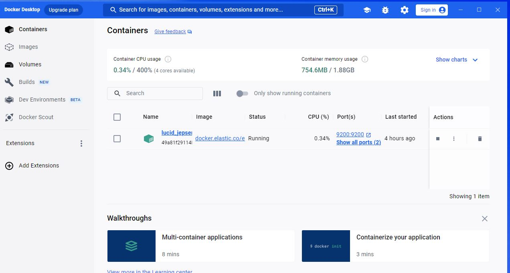
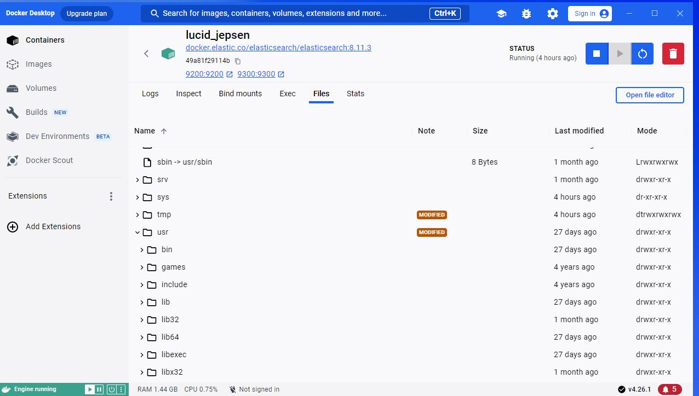
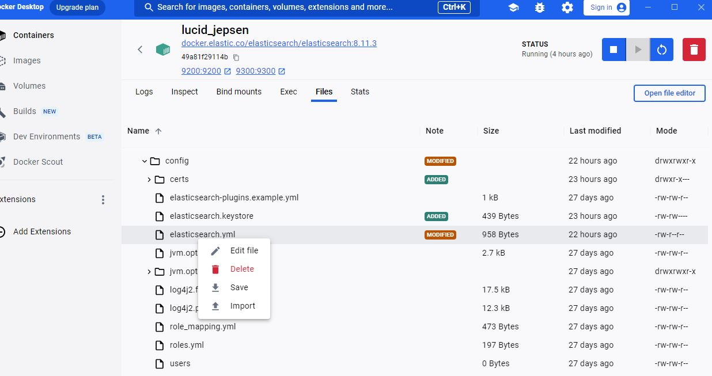

<a name="readme-top"></a>

# 📗 Table of Contents

- [📖 About the Project](#about-project)
  - [🛠 Built With](#built-with)
    - [Tech Stack](#tech-stack)
- [💻 Getting Started](#getting-started)
  - [Prerequisites](#prerequisites)
  - [Setup](#setup)
  - [Install](#install)
  - [Usage](#usage)
- [👥 Authors](#authors)
- [🤝 Contributing](#contributing)
- [⭐️ Show your support](#support)
- [🙏 Acknowledgements](#acknowledgements)
- [📝 License](#license)


# 📖 Flightfull <a name="about-project"></a>

**Rails search engine** is instant search engine through fake books data which gets data debending on user's input and trys to recommend books to the users regarding to their search.    

## 🛠 Built With <a name="built-with"></a>

### Tech Stack <a name="tech-stack"></a>

<details>
  <summary>Server</summary>
  <ul>
    <li><a href="https://rubyonrails.org/">Ruby on Rails</a></li>
    <li><a href="https://stimulus.hotwired.dev/">StimulusJS</a></li>
  </ul>
</details>

<details>
<summary>Database</summary>
  <ul>
    <li><a href="https://www.postgresql.org/">PostgreSQL</a> (development)</li>
  </ul>
</details>

## 💻 Getting Started <a name="getting-started"></a>

To get a local copy up and running, follow these steps.

### Prerequisites

In order to run this project you need:
  - Package manager like npm
  - VS code editor or equivlant
  - docker(for elasticsearch gem) 
### Setup

Setup elasticksearch with Docker:

```sh
docker run -d -p 127.0.0.1:9200:9200 -p 127.0.0.1:9300:9300 -e "discovery.type=single-node" docker.elastic.co/elasticsearch/elasticsearch:8.11.3
```
We need to change some values in elasticsearch.yml file:
for Ubuntu/Mac/WSL, in your terminal:
```sh
sudo nano /usr/share/elasticsearch/config/elasticsearch.yml
# or
sudo nano /etc/elasticsearch/elasticsearch.yml
```
for Docker on Windows:


Click on the container name (In the image above it's "lucid_jepsen")



Click on the files tab.under files tab you can find elasticsearch.yml in `/usr/share/elasticsearch/config/elasticsearch.yml`



Right click on elasticsearch.yml click on `Edit file`

______________________

we will change these two lines:

```sh
xpack.security.enabled: true

xpack.security.enrollment.enabled: true

```

to

```sh
xpack.security.enabled: false

xpack.security.enrollment.enabled: false

```

Clone this repository to your desired folder:
```sh
  cd my-folder
  git clone git@github.com:saied2035/rails_search_engine.git
```

### Install

Install this project with:

```sh
  cd rails_search_engine
  bundle install
```

### Usage

To run the project, execute the following command:

```sh
  rails db:create db:migrate db:seed
```

*hint: if the search is not working fllow the next steps in your terminal in the directory of the project*

```sh
rails c
```
this will open rails console, then type:

```sh
Book.reindex
```
<p align="right">(<a href="#readme-top">back to top</a>)</p>


## 👥 Authors <a name="authors"></a>

👤 **Saied Gaffer**

- GitHub: [@saied2035](https://github.com/saied2035)
- Twitter: [@SaiedGaffer](https://twitter.com/SaiedGaffer)
- LinkedIn: [LinkedIn](https://www.linkedin.com/in/saiedgaffer/)

<p align="right">(<a href="#readme-top">back to top</a>)</p>

## 🤝 Contributing <a name="contributing"></a>

Contributions, issues, and feature requests are welcome!

Feel free to check the [issues page](https://github.com/saied2035/rails_search_engine/issues/).

<p align="right">(<a href="#readme-top">back to top</a>)</p>

## ⭐️ Show your support <a name="support"></a>

Give a ⭐️ if you like this project!

<p align="right">(<a href="#readme-top">back to top</a>)</p>

## 🙏 Acknowledgments <a name="acknowledgements"></a>

- Microverse: [microverse community](https://github.com/microverseinc)
- Helpjuice team 

<p align="right">(<a href="#readme-top">back to top</a>)</p>

## 📝 License <a name="license"></a>

This project is [MIT](./LICENSE) licensed.

<p align="right">(<a href="#readme-top">back to top</a>)</p>